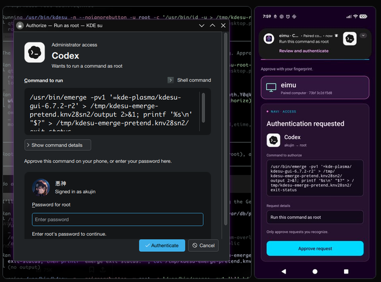

# kdesu Android biometric authentication

Approve a Linux **kdesu** root command on your Android phone. The phone shows the
requested command and requires a fresh strong biometric before signing it with
an Android Keystore key. A protected desktop helper verifies that signature and
executes the approved command.



*Desktop command review (left) and the corresponding phone approval screen (right).*

The standalone **Navi Authenticator** app can receive requests directly over local
Wi-Fi. That transport needs no KDE Connect, ADB, desktop notification daemon,
cloud account or Internet push service during normal authentication. kdesu itself
remains a graphical KDE program; the separate verification CLI can run headless.

**Experimental security software.** Real phone approval and root execution have
been demonstrated, but this is not a production login authenticator or a complete
security audit. Read [SECURITY.md](SECURITY.md) before installing the setuid helper.
Requester branding is currently caller-supplied, and update-signing custody is
part of the security boundary.

## What is included

| Component | Version / purpose |
| --- | --- |
| Android application | 0.8.1, API 30+, non-debuggable release mode |
| Host CLI and native/Python authority | Deployed 0.7.0 implementation |
| KDE patch and Gentoo packages | kdesu-gui 6.7.2-r2 against kde-cli-tools 6.7.2 |
| Direct Wi-Fi transport | Pinned TLS 1.3 to the phone on TCP 39841 |
| Optional KDE Connect transport | Existing file sharing, or paired-device IP lookup |
| Android CI | Builds debug and release modes with a disposable signing key |

The new dedicated KDE Connect plugin was a separate unfinished experiment. It is
not needed for this release and is not included as a working feature. Bluetooth
delivery, PAM, sudo, login, screen unlock and general PolicyKit integration are
not implemented. Installing this does not reroute those authentication systems.

## Start here

1. [Build, enroll and install](docs/INSTALL.md): prerequisites, initial ADB trust
   bootstrap, release update, and desktop deployment.
2. [Keep the phone available](docs/BACKGROUND.md): ongoing notification,
   background permissions, restart behavior and recovery.
3. [Architecture and protocol](docs/ARCHITECTURE.md): keys, exact request binding,
   ready/commit execution and revocation.
4. [Security findings](SECURITY.md) and [audit record](docs/SECURITY_AUDIT.md).
5. [Troubleshooting](docs/TROUBLESHOOTING.md) and
   [verified behavior](docs/VERIFICATION.md).
6. [Development and CI](CONTRIBUTING.md), including the existing KDE test suites.

After enrollment, a terminal can trigger a fresh approval:

```sh
python3 host.py authenticate --endpoint PHONE_IP:39841 \
  --application Terminal --operation 'Verify phone approval'
```

This prints `AUTHENTICATED` only after verifying the fresh phone signature. It
does **not** execute an elevated command. After installing and configuring the
desktop integration, use:

```sh
kdesu -n --noignorebutton -c '/usr/bin/id -u > /run/navi-auth/example.uid'
```

Review the exact command on the phone and approve. The result should contain `0`.
kdesu status 0 confirms command **launch**, not the child's eventual exit status.
The install guide explains independent result verification and password fallback.

## Build size and signing

The verified offline Android build uses SDK platform/build-tools 34, JDK 17+,
plain Java and Android framework APIs. There are no third-party Android runtime
libraries. The locally verified 0.8.1 release APK was about **71 KB**; exact bytes
vary with compiler and signer. Gradle/Android Studio metadata is also included,
but `build.sh` is the verified route and no Gradle wrapper is bundled.

New enrollment currently requires an explicitly debuggable build and authorized
ADB. Then install a release build **in place with the same app signing key**.
Do not uninstall or clear storage to update an enrolled phone. Each builder owns
their signing identity; this repository contains no private signing key or pairing
state. CI artifacts use a new temporary key per run and are disposable build
checks, not updates for an existing installation.

## License

Original code: [MIT](LICENSE). KDE/Gentoo code and the bundled requester icon retain
their existing licenses; see [third-party notices](THIRD_PARTY_NOTICES.md).
