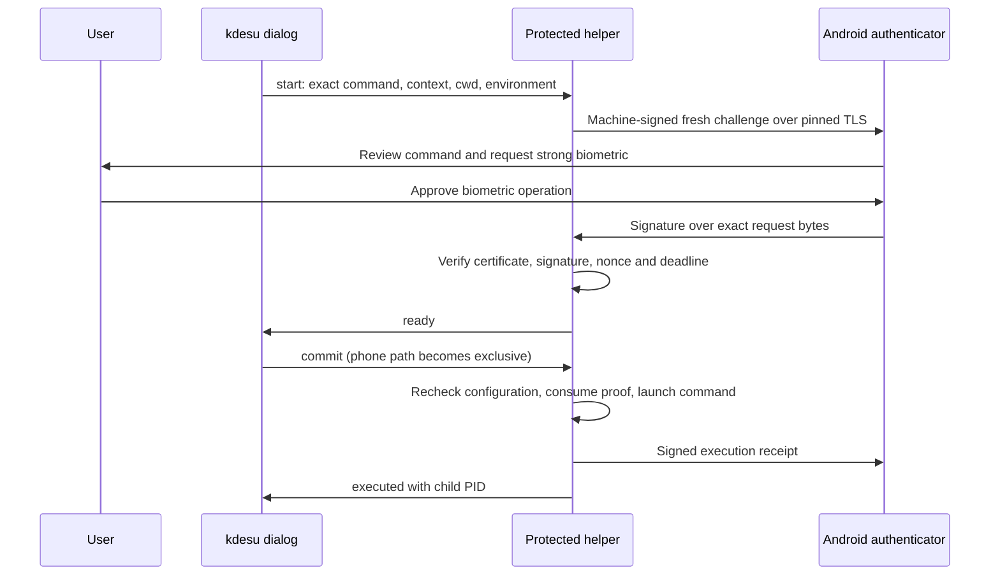

# Architecture

## Components and execution boundary

`authorize.c` is a small root-owned setuid executable. It requires private process
pipes, derives the original caller UID from the kernel, clears inherited
environment/groups/descriptors, disables core dumps and invokes a fixed Python
3.14 interpreter in isolated mode. `rootauth.py` owns authorization and execution.
No desktop listening socket or persistent desktop authentication service is needed.

The helper must be `/usr/libexec/navi-auth/authorize`, with a protected directory
chain. kdesu checks its ownership and permissions before launching it. Code and
trust must be installed by an administrator; running a user-writable verifier as
root would destroy this boundary.

`host.py` is the unprivileged enrollment and diagnostic CLI. Its displayed command
is metadata. Only the installed authority executes commands.

## Three distinct keys

| Identity | Storage and use |
| --- | --- |
| Phone biometric P-256 key | Android Keystore; per-operation strong biometric required; signs approvals |
| Phone TLS transport key | Separate Android Keystore key; its certificate is bound by the biometric key once when enabling LAN |
| Machine P-256 authority key | Desktop state; issues phone certificates and signs requests/receipts |

The APK update-signing key is a **fourth, separate identity**. It determines who
can supply compatible app updates, not who can approve a command.

The machine issues a one-year non-CA X.509 certificate for the enrolled phone
public key; its own CA certificate lasts ten years. Initial enrollment uses
authorized ADB plus biometric proof of possession. The phone pins the computer
key, and the computer keeps an explicit approved-phone record. An unknown machine
cannot enroll itself over the LAN listener.

Android uses `BiometricPrompt.CryptoObject(Signature)` with a per-operation strong
biometric requirement. This is Android biometric strength selection, not a
fingerprint-only modality guarantee. A qualifying face biometric may also be
offered. Hardware enforcement is checked locally; there is no remote attestation
verifier in this project. Fingerprint templates do not leave Android.

## Wire format and freshness

The phone protocol domain is `android-linux-fingerprint/v1`. JSON envelopes carry
base64-encoded exact UTF-8 payload bytes and DER ECDSA/SHA-256 signatures. Public
keys are DER SubjectPublicKeyInfo; certificates are DER X.509. Verifiers check
the original decoded bytes rather than reserializing received objects.

Requests bind request ID, random 256-bit nonce, machine/phone key IDs, approved
certificate hash, operation, issue/expiry times and display context. Privileged
requests additionally bind the exact `/bin/sh -c` command, target credentials,
held working-directory inode, restricted environment and desktop dialog ID.
Approval and commit share a 120-second deadline. SQLite consumes each pending
proof once. A certificate by itself is not a reusable authentication token.

Direct LAN uses TLS 1.3. Before sending command metadata, the host verifies that
the peer certificate exactly matches the TLS binding signed by the approved phone
biometric key. Each RPC is machine-signed and bound to a fresh server nonce.
Frames and transaction lifetimes are bounded. Certificate pinning authenticates
the endpoint even when routing information comes from KDE Connect.

## One execution owner

The private-pipe protocol is `navi-auth-exec/v1`: `start`, `ready`, `commit`,
`executed`, `cancel`, `canceled`, and errors. Password entry remains available
before commit. Selecting another path cancels the phone path before proceeding.
Once committed, a missing acknowledgement means **uncertain execution**; no
automatic password fallback or retry is allowed. Inspect the operation's result
before considering another invocation.

The root command has a separate session and redirected streams. Its launch can
outlive the helper and dialog. An `executed` message with a positive PID confirms
launch only. The native helper has a 180-second maximum lifetime; KDE has a
separate 20-second postcommit acknowledgement deadline.

The authority accepts one configured desktop UID and root as target, one active
request at a time, printable commands up to 512 characters, normal scheduling,
visible commands and nonterminal execution. `kdesu -t` and `-d` are ineligible.

## Trust, revocation and records

Development state defaults to `.state/` alongside `host.py`; use the global
`--state-dir` option before the subcommand to choose another private directory.
The installed snapshot lives in `/etc/navi-auth/config.json` and
`/var/lib/navi-auth/`, root-owned 0700, with credentials mode 0600. The execution
database and `last-execution.json` store approval/receipt evidence;
`commands.log` receives command diagnostics. These can contain sensitive commands.

`host.py revoke` only changes development state. The installed configurator's
`--revoke` disables protected authorization. The configuration digest is rechecked
at commit: revocation observed before that point prevents execution; an already
committed command is not undone. A stronger revoke-return concurrency guarantee
has not been established. Stopping phone notifications alone is not revocation.

The current phone UI lists paired computers and supports **Reset key and all
pairings**. That reset affects every computer and invalidates existing enrollment;
there is no polished per-computer forget workflow yet.

## KDE Connect options

The included `kdeconnect_transport.py` uses existing file sharing with Navi's
Android DocumentsProvider. Select Navi Authenticator as KDE Connect's custom
destination folder, grant access, then use
`host.py authenticate --kdeconnect-messages DEVICE_ID`. Signed replies and
cancellations travel through the existing pairing. Ordinary files go to Downloads.
Both transports share the phone's single active request mailbox.

`--kdeconnect-device DEVICE_ID` instead resolves the current IP and still uses
direct TLS; it is not the file-sharing transport. The protected configurator
supports `lan` and `kdeconnect-share`. These modes require KDE Connect/D-Bus
dependencies where used. The dedicated new KDE Connect plugin is unfinished and
is outside this published deployed snapshot.
