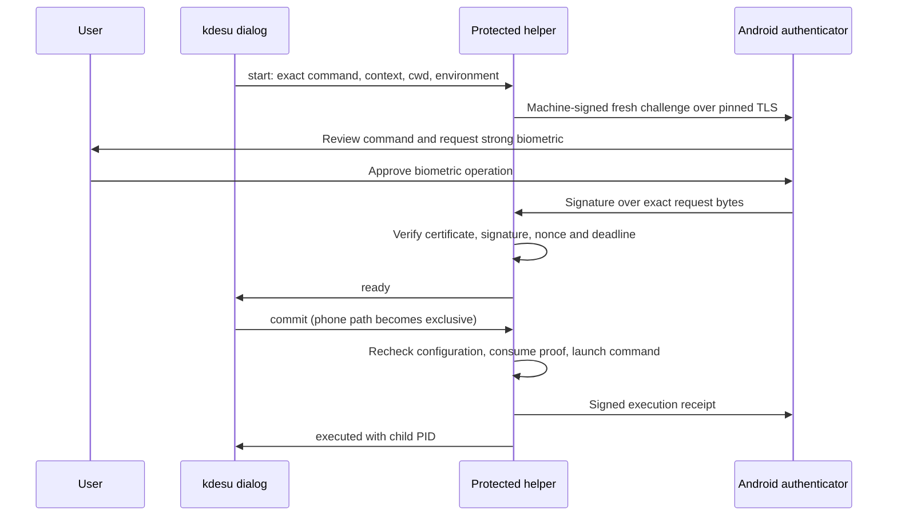

# Architecture

## Components and execution boundary

```mermaid
sequenceDiagram
    participant U as User
    participant K as kdesu dialog
    participant H as Protected helper
    participant P as Android authenticator
    K->>H: start: exact command, context, cwd, environment
    H->>P: Machine-signed fresh challenge over pinned TLS
    P->>U: Review command and request strong biometric
    U->>P: Approve biometric operation
    P->>H: Signature over exact request bytes
    H->>H: Verify certificate, signature, nonce and deadline
    H->>K: ready
    K->>H: commit (phone path becomes exclusive)
    H->>H: Recheck configuration, consume proof, launch command
    H->>P: Signed execution receipt
    H->>K: executed with child PID
```

`authorize.c` is a small root-owned setuid executable. It requires private process
pipes, derives the original caller UID from the kernel, clears inherited
environment/groups/descriptors, disables core dumps and invokes the system default
`/usr/bin/python3` in isolated mode (`-I`). On Gentoo that is python-exec, which
follows the root-owned `eselect python` setting; the helper's cleared environment
means `EPYTHON` cannot redirect it to another interpreter. `rootauth.py` owns authorization and execution.
No desktop listening socket or persistent desktop authentication service is needed.

The helper must be `/usr/libexec/navi-auth/authorize`, with a protected directory
chain. kdesu checks its ownership and permissions before launching it. Code and
trust must be installed by an administrator; running a user-writable verifier as
root would destroy this boundary.

`host.py` is the unprivileged enrollment and diagnostic CLI. Its displayed command
is metadata. Only the installed authority executes commands.

## Three distinct keys

| Identity | Storage and use |
| --- | --- |
| Phone biometric P-256 key | Android Keystore; per-operation strong biometric required; signs approvals |
| Phone TLS transport key | Separate Android Keystore key; its certificate is bound by the biometric key once when enabling LAN |
| Machine P-256 authority key | Desktop state; issues phone certificates and signs requests/receipts |

The APK update-signing key is a **fourth, separate identity**. It determines who
can supply compatible app updates, not who can approve a command.

The machine issues a one-year non-CA X.509 certificate for the enrolled phone
public key; its own CA certificate lasts ten years. The phone pins the computer
key, and the computer keeps an explicit approved-phone record. An unknown machine
cannot enroll itself over the LAN listener.

### Code enrollment (release builds)

Initial trust comes from a one-time code that the user reads on the computer and
types into the phone, carried over an existing KDE Connect pairing:

1. `host.py enroll` (or the System Settings page) shares a machine-signed
   `enroll-offer` with the selected KDE Connect device and shows an 8-character
   Crockford-base32 code (40 bits, 10-minute lifetime). The offer carries the
   machine CA certificate, host name, the desktop's KDE Connect ID and
   `HMAC-SHA256(code, "navi-enroll-offer/v1\n" || payload)`.
2. The phone stores up to four unexpired offers but trusts none of them. When the
   typed code matches one offer's tag (five wrong attempts drop an offer), the
   phone pins that machine key and desktop route for the offer's lifetime and
   shares back an `enroll-hello`: its public key and key ID tagged with the same
   code under the `navi-enroll-hello/v1` label.
3. The computer accepts the hello only from the selected device, verifies the tag
   and key ID, issues the phone certificate and sends the normal `enroll` request
   bound to the `kdeconnect-share` transport.
4. `Bridge.validate` accepts an unknown machine or an `enroll` request only when
   it matches the pinned key and returns to the same desktop route. The usual
   biometric signature then proves possession; the pin is deleted on success.

Offers from other paired devices or apps cannot match the code the user is
reading, and all messages stay inside KDE Connect's paired channel, so the short
code is not exposed to offline guessing. Delivery to the phone is automatic with
Navi as the KDE Connect destination (Android 10+). On Android 9–10 Navi can
instead import recent `navi-auth-*.json` files from `Download/` while it is open.
A saved offer the user opens with Navi or the file picker (offers only) is fully
validated, but it is stored for code entry only when Navi can follow the rest of
the enrollment from Downloads. Otherwise (Android 11+, or no storage access) Navi
discards it and shows the KDE Connect destination setup, because the enrollment
request would land where Navi cannot read it. On
Android 9 the documents provider only serves Navi's outgoing replies and is not
offered as a destination folder.

Release builds reject every other enrollment in the shared validator, before the
request is shown, regardless of delivery route. A debuggable build still accepts
the original trusted ADB bootstrap (`host.py enroll --serial`), kept as a
fallback for Android 9 devices. A valid signature from an unknown key never
establishes trust on its own.

Android uses `BiometricPrompt.CryptoObject(Signature)` with a per-operation strong
biometric requirement. This is Android biometric strength selection, not a
fingerprint-only modality guarantee. A qualifying face biometric may also be
offered. Hardware enforcement is checked locally; there is no remote attestation
verifier in this project. Fingerprint templates do not leave Android.

## Wire format and freshness

The phone protocol domain is `android-linux-fingerprint/v1`. JSON envelopes carry
the exact payload bytes and DER ECDSA/SHA-256 signatures. Public
keys are DER SubjectPublicKeyInfo; certificates are DER X.509. Verifiers check
the original decoded bytes rather than reserializing received objects.

The signed bytes are compact JSON with sorted keys, encoded as UTF-8 (non-ASCII
text is not `\u`-escaped). An envelope carries them in exactly one of two forms:

- `payload_b64`: base64 of the bytes, used below 250 bytes or when compression
  would not make the message smaller;
- `payload_deflate_b64` with `payload_dictionary_sha256`: base64 of raw DEFLATE
  (level 9) using a **preset dictionary**, named by its SHA-256.

Signatures always cover the uncompressed bytes. The dictionaries are committed
files (`dictionaries/navi-deflate-N.dict`, with `dictionaries/DEFAULT` naming the one
the computer compresses with), installed under `/usr/libexec/navi-auth/dictionaries/`
and packaged into Navi's assets. Builds only copy them; `make dictionary` creates a
new one from `dictionaries/navi-deflate.sections` for a developer to commit, and
older files stay so older peers keep working. A compressed payload with a missing
or unknown dictionary hash, both forms, or neither is rejected, and inflating stops
at 128 KiB. Navi answers with the same form and dictionary the request used. Every
message on the wire stays within 64 KiB; a request that would not is refused before
it is signed.

Certificates are public; no private key is ever sent. Enrollment requests and
pairing offers carry both certificates in full (`machine_certificate_b64`,
`phone_certificate_b64`). Paired requests (authenticate, remote setup) carry only
their SHA-256 (`machine_certificate_sha256`, `phone_certificate_sha256`): Navi resolves
them from its stored pairing for the signed `machine_id`, refuses any mismatch, and
never takes a certificate from a paired request itself. Responses name the phone
certificate the same way the request did.

Requests bind request ID, random 256-bit nonce, machine/phone key IDs, approved
certificate hash, operation, issue/expiry times and display context. Privileged
requests additionally bind `execution` (`"shell": "/bin/sh -c"`, target credentials,
held working-directory inode, restricted environment) and the desktop dialog ID.
The command itself is carried once, as the signed `context.command`: it is what Navi
shows and exactly what the authority runs with `/bin/sh -c`. Navi rejects a request
that still carries an older `argv` copy, so mismatched versions fail closed.
Approval and commit share a 120-second deadline. SQLite consumes each pending
proof once. A certificate by itself is not a reusable authentication token.

Direct LAN uses TLS 1.3 on Android 10+. Android 9 uses TLS 1.2 with only
ECDHE-ECDSA/AES-GCM suites; the host accepts both. Before sending command metadata,
the host verifies that
the peer certificate exactly matches the TLS binding signed by the approved phone
biometric key. Each RPC is machine-signed and bound to a fresh server nonce.
Frames and transaction lifetimes are bounded. Certificate pinning authenticates
the endpoint even when routing information comes from KDE Connect.

## Concurrent enrolled phones

The protected registry contains up to 32 phone entries, each with an approved
certificate, enablement and route. Legacy single-phone configuration remains
readable. One desktop dialog creates independent signed challenges and nonces for
all enabled phones concurrently, with a shared command/context and deadline.
Transport failures, declines and invalid responses are isolated to their phone.

The first cryptographically verified response selects the winner. The helper
withdraws competing requests, then uses the existing ready/commit protocol to
consume only the winning proof and launch the command once. Cancellation has
priority if it arrives alongside an approval. Slow transfer completion precedes
its signed withdrawal; file transports retain cancellation tombstones. This
fan-out does not allow multiple desktop dialogs to share execution authority.

Desk reader mode affects only prompt initiation in the Android activity. It
checks foreground focus, unlocked state, validated request kind, expiry and
withdrawal before entering the unchanged per-use CryptoObject flow. The last
automatically prompted request ID persists to prevent prompt loops after restart.
Enrollment is never automatically prompted.

## One execution owner

The private-pipe protocol is `navi-auth-exec/v1`: `start`, `ready`, `commit`,
`executed`, `cancel`, `canceled`, and errors. Password entry remains available
before commit. Selecting another path cancels the phone path before proceeding.
Once committed, a missing acknowledgement means **uncertain execution**; no
automatic password fallback or retry is allowed. Inspect the operation's result
before considering another invocation.

The root command has a separate session and redirected streams. Its launch can
outlive the helper and dialog. An `executed` message with a positive PID confirms
launch only. The native helper has a 180-second maximum lifetime; KDE has a
separate 20-second postcommit acknowledgement deadline.

The authority accepts one configured desktop UID and root as target, one active
request at a time, printable commands up to `MAX_COMMAND` characters (default
10240, set at install with `make install MAX_COMMAND=N` or the ebuild's
`NAVI_AUTH_MAX_COMMAND`), normal scheduling, visible commands and nonterminal
execution. Newlines and tabs are allowed in commands (sudo approval); other control
characters, carriage returns and bidirectional overrides are not. kdesu itself
refuses any command with a newline or tab before it starts authentication ("It
contains invalid characters"), so kdesu commands are single-line. `kdesu -t` and `-d` are
ineligible. Navi's own limit is set when it is built (`NAVI_MAX_COMMAND` for
`./build.sh`) and must be at least the computer's.

Navi shows the full command. Longer than 512 characters or 12 rows, it is collapsed
and a tap expands it. The formatted view numbers real lines and adds marked display
breaks after top-level `&&`, `||`, `;` and `|` (never inside quotes, `$(…)` or
backticks), with tabs as four spaces; **Exact** shows the text as signed, tabs as
`⇥`. These are display choices only.

## Trust, revocation and records

Development state defaults to `.state/` alongside `host.py`; use the global
`--state-dir` option before the subcommand to choose another private directory.
The installed snapshot lives in `/etc/navi-auth/config.json` and
`/var/lib/navi-auth/`, root-owned 0700, with credentials mode 0600. The execution
database and `last-execution.json` store approval/receipt evidence;
`commands.log` receives command diagnostics. These can contain sensitive commands.

The setuid helper also accepts two non-executing requests from the configured
desktop account, each a single line on the same pipe protocol: `status` returns a
read-only summary of the protected configuration (phone key IDs, enablement,
transport, KDE Connect route and certificate expiry; nothing for other accounts),
and `revoke` disables the caller's own KDE Connect device. `host.py
authority-status` and `authority-revoke` and the System Settings page use them.
Neither takes the authority lock, and neither can add or enable a phone. Enabling
goes through polkit (`in.akuj.navi-auth.configure-authority`, `auth_admin`) to the
fixed `/usr/libexec/navi-auth/configure` wrapper, i.e. the same configurator an
administrator would run, limited to the requesting user's own account and state.

`host.py revoke` only changes development state. The installed configurator's
`--revoke` disables all protected phones, or one when combined with
`--phone-key-id`. Configuration writes and execution commit share a lock, and the
exact configuration digest is rechecked at commit. A change before commit prevents
execution; an already committed command is not undone. Stopping phone notifications
alone is not revocation.

The current phone UI lists paired computers (**☰ → Paired computers**) and
supports **Reset key and all pairings** (**☰ → Settings**). That reset affects every computer and invalidates existing enrollment;
there is no polished per-computer forget workflow yet.

## KDE Connect options

The included `kdeconnect_transport.py` uses existing file sharing with Navi's
Android DocumentsProvider on Android 10+. Select Navi Authenticator as KDE Connect's custom
destination folder, grant access, then use
`host.py authenticate --kdeconnect-messages DEVICE_ID`. Signed replies and
cancellations travel through the existing pairing. Ordinary files go to Downloads.
Both transports share the phone's single active request mailbox.

`--kdeconnect-device DEVICE_ID` instead resolves the current IP and still uses
direct TLS; it is not the file-sharing transport. The protected configurator
supports `lan` and `kdeconnect-share`. These modes require KDE Connect/D-Bus
dependencies where used. The dedicated new KDE Connect plugin is unfinished and
is outside this published deployed snapshot.

## Remote approvals (ntfy fallback)

`ntfy_transport.py` adds an optional route for phones KDE Connect cannot see
(details and threat model in [Remote approvals](REMOTE.md)). For KDE Connect
phones `ChainPhone` decides each request's route before signing it: KDE Connect
discovery (`kdeconnect_lan_addresses()`), then a TCP probe of Navi's port 39841
(`lan_probe()`). The port open selects the direct pinned-TLS route
(`NetworkPhone`); the phone present with the port closed selects KDE Connect
messages; KDE Connect not seeing the phone, or nothing answering, selects ntfy.
A local route that fails after the choice falls back to ntfy. Only a request
carried by KDE Connect binds Navi's reply to the KDE Connect device. Explicit
test routes (`--kdeconnect-messages`, `--kdeconnect-device`, `--remote-only`)
use `RoutedPhone` or a single transport.

- Setup is a `remote-setup` request over the normal route. The computer's
  ephemeral P-256 key is inside the signed payload; Navi signs
  `payload ‖ "\n" ‖ its ephemeral P-256 SPKI` with the biometric key. Both sides
  derive the message key and both inbox topic names with HKDF-SHA256 (salt: setup
  request id); none of them is transmitted.
- Messages are `base64url(nonce ‖ AES-256-GCM(DEFLATE(json)))` with AAD
  `navi-remote/v2\n<direction>\n<topic>`; inflate is capped at 128 KiB. Requests carry
  the standard signed envelope unchanged (dictionary-compressed payload, certificates
  by hash), exactly as on KDE Connect and the direct route; receipts and cancels refer
  to the request by `request_sha256`; responses carry only the signature. v1 and v2
  peers cannot open each other's messages (the protocol name is in the AAD); key and
  topic derivation keep their fixed `navi-remote/v1` HKDF labels, so upgrading needs
  no new setup.
- Signed requests sent over ntfy carry `remote: {"kind": "ntfy"}` and, instead of
  the inline PNG, `context.icon_sha256`. Navi uses a built-in or cached icon with
  that hash, otherwise asks (`icon-request`) for it; the computer answers only with
  the PNG of the current request.

### Requester icons

Navi has common requester icons built in, named by SHA-256: Claude (the desktop
app's icon, also used for the Claude CLI), Konsole, Kitty, and the generic icons
kdesu and the PAM helpers use, each rendered for every installed icon theme. They
are committed files (`icons/<sha256>.png`, `icons/manifest.json`), made by
`make icons` with kdesu's own rendering, installed under
`/usr/libexec/navi-auth/icons/` and packaged into Navi's assets. The computer picks
a request's icon in this order:

1. the process chain above the request (the account's own processes only): an
   agent such as Claude anywhere in the chain, otherwise the nearest Konsole or
   Kitty, in the desktop's icon theme (`[Icons] Theme` in `kdeglobals`);
2. kdesu's own PNG, reduced to its hash when Navi has that exact icon built in;
3. for sudo, SDDM and the lock screen, a default (`utilities-terminal`,
   `system-log-out`, `system-lock-screen`).

In cases 1-3 the signed request carries only `icon_sha256`, on every route.
Anything else travels as before (inline PNG; over ntfy, on request). The icon is a
display label only. The `requested` journal line records `icon=<hash prefix>`.
- On the computer the HTTP client is a worker process running as the desktop user
  that moves only ciphertext; in `rootauth.py` the key stays in the root process.
  On the phone, `NetworkService` holds one streaming subscription per server and
  resumes from the last message id.
